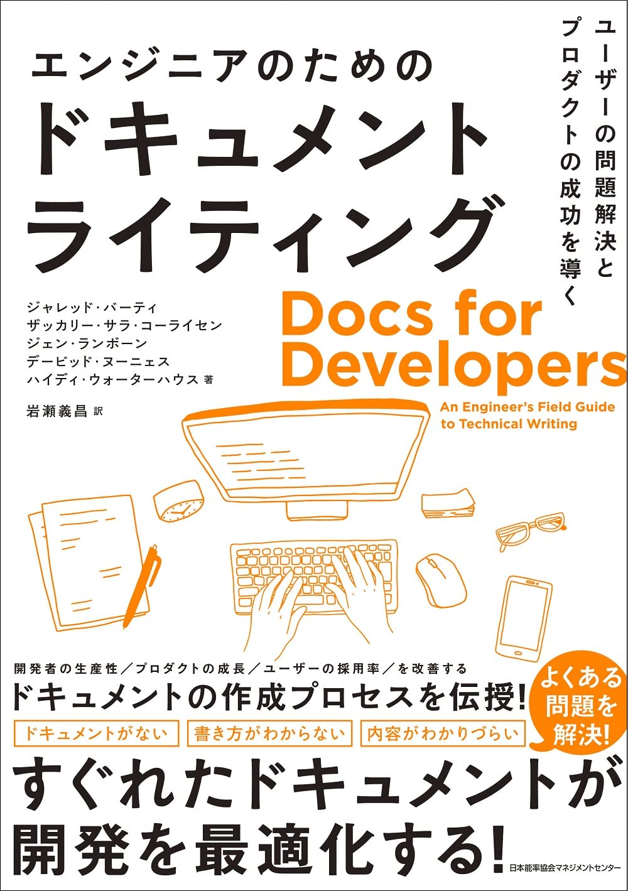
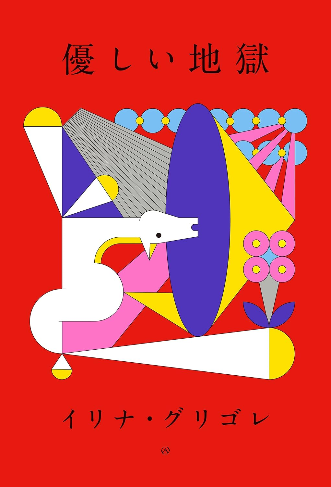

# README

## About

本の表紙画像から書籍情報を抽出する AI を [Document AI](https://cloud.google.com/document-ai?hl=ja) を用いて作成した。
また、作成した AI を呼び出すための API を作成し、cloud functions にデプロイした。
さらに、デプロイした関数を呼び出すためのスクリプトを作成した。

- function.js: cloud functions にデプロイ。作成した Document AI の API を叩く。
- package.json: cloud functions にデプロイ。パッケージ情報。
- image2text-test.mjs: ローカルから cloud function を呼び出すスクリプト。クラウド上の function.js を呼び出す。

## Quick Start

### 例 1


````cmd
 node .\image2text-test.mjs
{
  title: 'THE HARE\nWITH\nAMBER\nEYES\nA HIDDEN\nINHERITANCE',
  authors: [ 'EDMUND DE WAAL' ],
  subtitles: [ 'A HIDDEN\nINHERITANCE' ]
}


### 例 2



```cmd
 node .\image2text-test.mjs
{
  title: 'エンジニアのための\nドキュメント\nライティング',
  authors: [
    'ジャレッド・バーティ',
    'ザッカリー・サラ・コーライセン',
    'ジェン・ランボーン',
    'デービッド・ヌーニェス',
    'ハイディ・ウォーターハウス著',
    '岩瀬義昌 訳'
  ],
  subtitles: [ "An Engineer's Field Guide\nto Technical Writing" ]
}
````

[画像引用](https://pub.jmam.co.jp/book/b622627.html)

### 例 3



```cmd
node .\image2text-test.mjs
{ title: '優しい地獄', authors: [ 'イリナ・グリゴレ' ], subtitles: [] }

```

[画像引用](https://www.akishobo.com/book/detail.html?id=1071)
